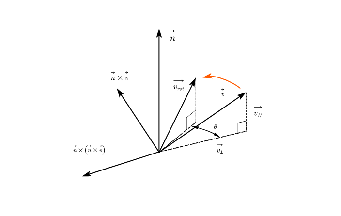

# 前言
本文主要介绍在计算机图形学中一个很牛逼的公式-----**罗德里格斯自由旋转公式**。形式上长这样
$$
    cos\theta \mathbf{I} +(1-cos\theta)\mathbf{n}\mathbf{n}^T+sin\theta \mathbf{N}
$$
其中 $\mathbf{n}$ 是旋转轴, $\mathbf{N}$ 是叉积矩阵。

罗德里格斯(Rodrigues)自由旋转公式，是描述空间中向量旋转的公式,百度中描述为:
> 罗德里格旋转公式是计算三维空间中，一个向量绕旋转轴旋转给定角度以后得到的新向量的计算公式。这个公式使用原向量，旋转轴及它们叉积作为标架表示出旋转以后的向量。可以改写为矩阵形式，被广泛应用于空间解析几何和计算机图形学领域，成为刚体运动的基本计算公式。

相比于绕坐标轴旋转的公式来说，这个绕某个设定的轴旋转的公式确实要更加的实用。

# 数学推导
## 前期准备
在正式推导前，我先把要用到的数学公式提前写在这，以便查阅。
1. 叉乘矩阵
$$
\begin{equation}
\begin{pmatrix}
 x_a\\
 y_a\\
 z_a
\end{pmatrix}
\times \begin{pmatrix}
 x_b\\
 y_b\\
 z_b
\end{pmatrix}=\begin{pmatrix}
 y_az_b-z_ay_b\\
 z_ax_b-x_az_b\\
 x_ay_b-y_ax_b
\end{pmatrix}=\begin{pmatrix}
 0&-z_a&y_a\\
 z_a&0&-x_a\\
 -y_a&x_a&0
\end{pmatrix}\begin{pmatrix}
 x_b\\
 y_b\\
 z_b
\end{pmatrix}
\end{equation}
$$
2. 向量三重积展开
$$
    \begin{equation}
    \vec{a} \times (\vec{b} \times \vec{c} ) = (\vec{a} \cdot \vec{c} )\vec{b} - (\vec{a} \cdot \vec{b} )\vec{c} 
    \end{equation}
$$
3. 叉积矩阵性质
$$
    \begin{equation}
    N^2=nn^T-I
    \end{equation}
$$
## 问题模型及求解

问题可描述如下，已知 $\vec{v}$ 是三维空间中一向量，$\vec{n}$ 是与转轴同向的单位向量，$\theta$ 是 $\vec{v}$ 绕 $\vec{n}$ 的右手（逆时针）方向旋转经过的角度，求旋转后向量 $\vec{v_{rot}}$。

**Step1**:

将 $\vec{v}$ 分为与 $\vec{n}$ 垂直的分量 $\vec{v_{\bot }}$ 和平行的分量 $\vec{v_{//}}$,有 $\vec{v} = \vec{v_{\bot}}+\vec{v_{//}}$。
$$
    \left\{\begin{align*} 
    \vec{v_{//}}&=(\vec{n}\cdot \vec{v})\cdot \vec{n} \\
    \vec{v_{\bot }}&=\vec{v}-\vec{v_{//}}=(\vec{n}\cdot\vec{n})\cdot \vec{v} - (\vec{n}\cdot \vec{v})\cdot \vec{n}
    \end{align*}\right.   
$$
由公式(2)(向量三重积展开)可得
$$
    \vec{v_{\bot }}=-\vec{n}\times (\vec{n}\times \vec{v})
$$

**Step2**:

从图中可得出
$$
    \vec{v_{rot//}}=\vec{v_{//}}
$$

现在只要求出 $\vec{v_{rot\bot}}$ 就能求出 $\vec{v_{rot}}$了。由于 $\left | \left | \vec{v_{rot\bot}} \right |  \right | = \left | \left | \vec{v_{\bot}} \right |  \right |$ ,而且 $\vec{v_{rot\bot}}$ 可拆分为 $\vec{n}\times \vec{v}$ 与 $\vec{v_{\bot}}$ 向量的和,所以将 $\vec{v_{rot\bot}}$ 表示为这两个向量方向单位向量乘各自对应标量后得到的向量的和: 
$$
    \begin{align*}
    \vec{v_{rot\bot}} &= \frac{\vec{v_{\bot}}}{\left | \left | \vec{v_{\bot}} \right |  \right |} \cdot \left | \left | \vec{v_{\bot}} \right |  \right |cos\theta + \frac{\vec{n}\times\vec{v}}{\left | \left | \vec{n}\times\vec{v}   \right |  \right | }\cdot \left | \left | \vec{n}\times\vec{v}   \right |  \right | sin\theta \\
    &= \vec{v_{\bot}}\cdot cos\theta + (\vec{n}\times \vec{v})\cdot sin\theta 
    \end{align*}
$$

**Step3**:
综合以上，可得:
$$
    \begin{align*}
        \vec{v_{rot}} &= \vec{v_{rot//}} + \vec{v_{rot\bot}}\\
        &= \vec{v_{rot//}} + (\vec{v}-\vec{v_{rot//}})\cdot cos\theta + (\vec{n}\times \vec{v})\cdot sin\theta \\
        &= cos\theta\cdot\vec{v}+(1-cos\theta)\cdot\vec{v_{//}}+(\vec{n}\times \vec{v})\cdot sin\theta \\
        &= cos\theta\cdot\vec{v} + (1-cos\theta)\cdot(\vec{n}\cdot\vec{v})\cdot\vec{n}+(\vec{n}\times \vec{v})\cdot sin\theta
    \end{align*}
$$

**Step4**:

化简为矩阵形式:
$$
    \begin{align*}
        \vec{v_{rot}} &= \vec{v}-\vec{v}+cos\theta\cdot\vec{v} + (1-cos\theta)\cdot(\vec{n}\cdot\vec{v})\cdot\vec{n}+(\vec{n}\times \vec{v})\cdot sin\theta \\
        &= \vec{v}-(1-cos\theta)\cdot\vec{v}+(1-cos\theta)\cdot(\vec{n}\cdot\vec{v})\cdot\vec{n}+(\vec{n}\times \vec{v})\cdot sin\theta \\
        &= \vec{v} + (1-cos\theta)\cdot[(\vec{n}\cdot\vec{v})\cdot\vec{n}-(\vec{n}\cdot\vec{n})\cdot\vec{v}] + (\vec{n}\times\vec{v})\cdot sin\theta
    \end{align*}
$$
由公式(2)可得
$$
    \vec{v_{rot}} = \vec{v} + (1-cos\theta)\cdot(\vec{n}\times(\vec{n}\times{v})) + (\vec{n}\times\vec{v})\cdot sin\theta
$$
由公式(1),用矩阵 $\mathbf{N}$ 替换 $\vec{n}$
$$
    \begin{align*}
        \vec{v_{rot}} &= \vec{v} + (1-cos\theta)\cdot\mathbf{N}^2\cdot\vec{v} + \mathbf{N}\cdot\vec{v}\cdot sin\theta \\
        &= [\mathbf{I}+(1-cos\theta)\cdot\mathbf{N}^2+\mathbf{N}\cdot sin\theta]\cdot\vec{v}
    \end{align*}
$$
又由公式(3),可将上式改写成
$$
    \vec{v_{rot}} = [cos\theta \mathbf{I} +(1-cos\theta)\mathbf{n}\mathbf{n}^T+sin\theta \mathbf{N}]\cdot\vec{v}
$$
令 $M=cos\theta \mathbf{I} +(1-cos\theta)\mathbf{n}\mathbf{n}^T+sin\theta \mathbf{N}$ ，则 
$$
    \vec{v_{rot}} = M\cdot\vec{v}
$$

# 总结
在计算机图形学中,掌握**MVP**变换是基本要求,其中在模型变换中，绕坐标轴旋转很不实用，因为现实中并没那么多理想情况。由此实现绕任意轴旋转的罗德里格斯自由旋转公式应用就非常广，需牢牢掌握。