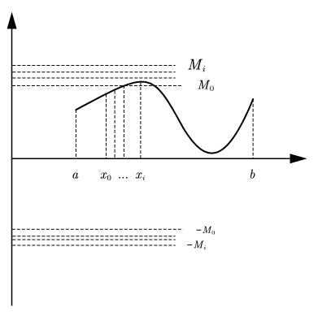
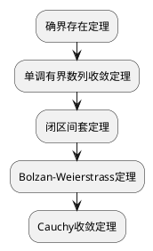

如标题所言，我们在学习极限的局部有界性的时候有以下推论:
> 若 $y=f(x)$ 在 $[a,b]$ 上为连续函数,则 $f(x)$ 在 $[a,b]$ 上必定有界。

但变成开区间后则变成下面的推论:
> 若 $y=f(x)$ 在 $(a,b)$ 上为连续函数,且 $\lim_{x \to a^+} f(x)$ 与 $\lim_{x \to b^-}f(x)$ 都存在,则 $f(x)$ 在 $[a,b]$ 上必定有界。

那么，为什么会变成这样呢？换句话说，为什么开区间缺失了端点的值就会导致有界性大变，需要加强条件来控制边界呢？今天，我们就来探究一下其中的秘密。

# 直观解释
首先，函数 $f(x)$ 在 $x_0$ 点连续的定义为 $lim_{x \to x_0}f(x) = f(x_0)$ ,则 $f(x)$ 在闭区间连续则为对区间中的每个点都连续，所以无论哪个点都有 $lim_{x \to x_0}f(x) = f(x_0)$ 。因此根据局部有界性:
> 如果 $lim_{x \to x_0}f(x)=A$ ,则存在正常数 $M$ 和 $\delta$ ,使得当 $0<|x-x_0|<\delta$ 时,有 $|f(x)|\le M$ 。

对于闭区间 $[a,b]$ 中的点 $x_0$ ,在其邻域内,$f(x)$ 都有界 $M_i$ 。取所有点对应的界的最大值,即 $M=max\{M_i\}$ ,则对于整个闭区间来说, $|f(x)|\le M$ 。过程如图所示：

那么,对于开区间 $(a,b)$ 呢?由于在端点不连续,即 $lim_{x \to a^+}f(x) \ne  f(a)$ 及 $lim_{x \to b^-}f(x) \ne  f(b)$。那么端点的值就无法由连续保证了，这时 $f(x)$ 在端点的值就有两种情况(以端点 $a$ 为例):
- $f(a)$ 为其它固定值,如 $f(a)=1000$ 。
- $f(a)$ 趋向于无穷大。

如果为第一种情况，无论取什么值都不会导致 $f(x)$ 无界；但如果为第二种情况，就会导致端点无界；因此需要用端点的极限来保证端点的函数值不会趋于无穷，即 $\lim_{x \to a^+} f(x)$ 与 $\lim_{x \to b^-}f(x)$ 都存在。

# 定理证明
## 闭区间连续函数必有界
> 若 $y=f(x)$ 在 $[a,b]$ 上为连续函数,则 $f(x)$ 在 $[a,b]$ 上必定有界。

**证明**：设 $x_0\in [a,b]$, 由于 $f(x)$ 在 $[a,b]$ 上连续,则
$$
    \forall \varepsilon >0 ,\exists \delta >0,\forall x(|x-x_0|<\delta ),成立:|f(x)-f(x_0)|<\varepsilon
$$
又由
$$
    |f(x)|=|f(x)-f(x_0)+f(x_0)|\le |f(x)-f(x_0)|+|f(x_0)|< \varepsilon+|f(x_0)|
$$
设 $M=\varepsilon+|f(x_0)|$ ,则 $|f(x)|<M$ ,故 $f(x)$ 有界。

由此得证。

## 开区间连续函数有界性
> 若 $y=f(x)$ 在 $(a,b)$ 上为连续函数,且 $\lim_{x \to a^+} f(x)$ 与 $\lim_{x \to b^-}f(x)$ 都存在,则 $f(x)$ 在 $[a,b]$ 上必定有界。

**证明**：由 $\lim_{x \to a^+} f(x)=A$ ,取 $\varepsilon=1$ 根据极限定义,存在一个 $\delta_1>0$(不妨设 $a+\delta_1<b$),当 $0<x-a<\delta_1$ 时,有
$$
    |f(x)-A|<1 \Rightarrow |f(x)| < |A|+1=M_1
$$
同理,因为 $\lim_{x \to b^-}f(x)=B$ ,取 $\varepsilon=1$,存在一个 $\delta_2>0$(不妨设 $b-\delta_2>a+\delta_1$),当 $0<b-x<\delta_2$ 时,有
$$
    |f(x)-B| < 1 \Rightarrow |f(x)| < |B|+1=M_2
$$
去掉两边，剩下中间的闭区间 $[a+\delta_1,b-\delta_2]$ 由于在此区间连续，故由[闭区间连续函数必有界](#闭区间连续函数必有界)定理可得
$$
    |f(x)| \le M_3
$$
取 $M=max\{M_1,M_2,M_3\}$ ,则对于开区间 $(a,b)=(a,a+\delta_1)\cup [a+\delta_1,b-\delta_2]\cup (b-\delta_2,b)$ 内的任意 $x$ ,都有 $|f(x)|\le M$。

由此得证。

# 深入思考
懒是一种美德。开区间连续函数判断有界还要算极限，那有没有什么性质或者条件，能不用算极限即可判断在此开区间连续的函数是有界的呢？有的有的，由此引出了一致连续的概念，一致连续的函数无论开区间还是闭区间都有界。

在[开区间连续函数有界性](#开区间连续函数有界性)这个证明中，我们大致分了三个区间，分别证明函数在这三个区间有界，然后整个大区间就有界。有没有想过为什么三个区间分别有界，则整个大区间就都有界呢？或者换句话说，区间的并集是如何保证等于这整个大区间的？就没有刚好某个点在大区间里，而不在区间的并集里呢？由此就引出实数的完备性的概念。
## 一致连续
> 设函数 $f(x)$ 在区间 $X$ 上定义,若对于任意给定的 $\varepsilon>0$,存在 $\delta>0$,只要 $x',x''\in X$ 满足 $|x'-x''|<\delta$,就成立 $|f(x')-f(x'')|<\varepsilon$ ,则称函数 $f(x)$ 在区间 $X$ 上一致连续。

上述定义虽然抽象，但却是绕不开的一环，简而言之，定义其实是在描述，在区间 $X$ 中任取满足 $|x'-x''|<\delta$ 的两点都成立 $|f(x')-f(x'')|<\varepsilon$ 则称函数一致连续。换句话说,就是 $\delta$ 的值不再由选取的点变化，只由 $\varepsilon$ 相关。

直观上来说，一致连续指的是图像平缓的函数,如 $y=sinx$ ;非一致连续指的是图像有陡峭部分的函数,如 $y=\frac{1}{x}$ 。可看下面视频来理解一致连续的定义是怎么来的
<iframe width="100%" height="468" src="//player.bilibili.com/player.html?bvid=BV1DD4y1R7fw&p=1&autoplay=0" scrolling="no" border="0" frameborder="no" framespacing="0" allowfullscreen="true" &autoplay=0> </iframe>
在理解了一致连续的概念后,就明白为什么光这条性质就不需要额外加条件来判断开区间有界了，因为一致连续就已经控制了函数的端点不会趋于无穷大。

## 实数系的完备性
实数系的完备性等价于实数系的连续性,且由下面几个基本定理间接地说明

这几个定理(证明可参考数学分析的教材)可以两两互推,且它们都是从不同角度说明实数系的完备性。为更好地说明完备性，先假设如果只有有理数集(不完备),我们构造一个闭区间和连续函数:
- 闭区间: $[0,2]$ 内的有理数。
- 函数: $f(x)=\frac{1}{x^2-2}$

在这个有理数闭区间上,这个函数是完全连续的。因为有理数的平方永远不可能等于2。但此函数无界,当取得有理数列趋近于 $\sqrt{2}$ (比如1.4,1.41,1.414...)代入函数,则函数会趋近于无穷。

回过头来看,加入了无理数的实数系由于填补了这个数轴的漏洞,所以保证了区间里的点没有遗漏，区间的并就等于一整个大区间也是顺理成章的事。而且基于实数系的完备性,才能说明闭区间连续的函数必有界，因为如果实数系不完备,就说明这个区间存在不知道是否连续的点,就无法保证闭区间内的点连续了。

由此看来,实数的完备性相当于数学里面的地基,没有这个,定理便何谈成立。