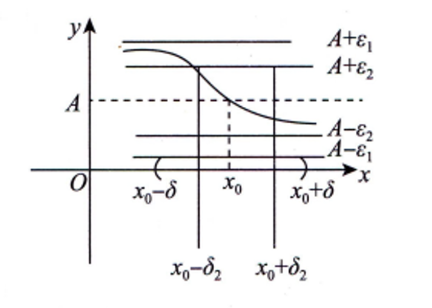

众所周知,局部保号性是极限的一个性质,其数学描述为:
> 若 $\lim_{x \to x_0} f(x)=A>0(或A<0)$,则存在 $\delta>0$,当 $0<|x-x_0|<\delta$时,成立 $f(x)>0(或f(x)<0)$。

> 若存在 $\delta>0$,当 $0<|x-x_0|<\delta$时, $f(x)\ge 0$(或 $f(x)\le 0$) 且 $\lim_{x \to x_0} f(x)=A$ ,则 $A\ge 0(或A \le 0)$。

可以看出来由极限推函数正负，为严格不等号(脱帽严格不等),但由函数推极限正负,为非严格不等号(戴帽非严格不等)。那为什么出现"戴帽非严格不等"的现象呢？接下来，由我来带大家探究一下。

# 直观解释
要理解这个等号由何而来，需精准地理解极限的定义到底在说什么，回顾一下极限的定义：
$$
\forall \varepsilon >0 ,\exists \delta >0,\forall x(0<|x-x_0|<\delta ),成立:|f(x)-A|<\varepsilon
$$
此定义描述的是一个动态过程,一个趋近的过程;可以在脑中想象这样的画面：在极限值 $A$ 的上下划定一个界 $\varepsilon$,这样总可以在函数中找到对应的 $x$ 满足对应的函数值到极限值的距离小于 $\varepsilon$。此动态过程如图所示:

可以预见,如此趋近下去,最终它们的距离将会变成0,即极限为 $A$。那么 $A$ 的值可能等于 $f(x_0)$ 也可能不等,取决于函数是否连续;于是,我们可以发现如果函数连续,即 $A=f(x_0)$ ,而 $f(x)$ 的范围限定在 $x_0$ 的去心邻域,因此有可能 $f(x_0)=0$;因此局部保号性的等号就是考虑到这种情况。例如: $f(x)=x^2(x\ne 0)$ 在0的去心邻域中 $f(x)>0$ ,但极限 $lim_{x \to 0} f(x)=0$。

当 $A\ne f(x_0)$ 时,极限也完全有可能等于0,例如：$f(x)=\{ \begin{matrix} x^2,x\ne 0\\ 
1,x=0
\end{matrix}$,$A\ne f(0)$,但 $A=0$。

那么,$A=f(x_0)$ 的符号可能与 $f(x)$ 相反吗？很明显，不可能,因为极限的趋近过程就是通过取邻域的值来趋近的,邻域的值的符号影响了极限，因此不可能相反。

# 数学证明
## 脱帽严格不等
> 若 $\lim_{x \to x_0} f(x)=A>0(或A<0)$,则存在 $\delta>0$,当 $0<|x-x_0|<\delta$时,成立 $f(x)>0(或f(x)<0)$。

**证明**:由 $\lim_{x \to x_0} f(x)=A$ 可知:
$$
    \forall \varepsilon >0 ,\exists \delta >0,\forall x(0<|x-x_0|<\delta ),成立:\\
    |f(x)-A|<\varepsilon \Rightarrow A-\varepsilon < f(x)
$$
由于 $\varepsilon$ 是任取的,因此取 $\varepsilon=\frac{A}{2}$ ,于是
$$
    f(x)>A-\frac{A}{2}=\frac{A}{2}>0
$$
由此得证。

## 戴帽非严格不等
> 若存在 $\delta>0$,当 $0<|x-x_0|<\delta$时, $f(x)\ge 0$(或 $f(x)\le 0$) 且 $\lim_{x \to x_0} f(x)=A$ ,则 $A\ge 0(或A \le 0)$。

**证明**:用反证法,假设结论不成立,即 $\lim_{x \to x_0} f(x)=A < 0$ ，同上,取 $\varepsilon=-\frac{A}{2}>0$,则
$$
    \exists \delta >0,\forall x(0<|x-x_0|<\delta ),成立:\\
    |f(x)-A|<-\frac{A}{2} \Rightarrow f(x)<\frac{A}{2}<0
$$
与条件矛盾,故结论成立,即 $\lim_{x \to x_0} f(x)=A\ge 0$。

由此得证。