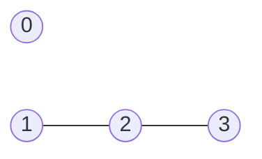
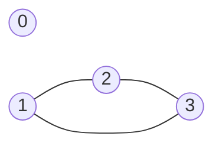
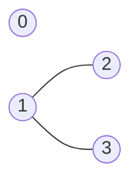

题目来自Leetcode：[针对图的路径存在性查询Ⅰ](https://leetcode.cn/problems/path-existence-queries-in-a-graph-i/description/)

今天的每日一题，由于点进去没看标题，一看题目描述心想怎么这么简单，直接写了个模拟法，测试用例没通过才发现这是图结构的题。话不多说，直接进入正题。
```cpp
class Solution {
public:
    vector<bool> pathExistenceQueries(int n, vector<int>& nums, int maxDiff, vector<vector<int>>& queries) {
        //模拟法
        vector<bool> res;
        for(auto querie:queries){
            if(abs(nums[querie[0]]-nums[querie[1]])<=maxDiff)
                res.push_back(true);
            else
                res.push_back(false);
        }
        return res;
    }
};
```
# 题目分析
首先，由题目分析可得出以下信息:
- 有`n`个图节点以及这些节点对应的数值数组`nums`（**非递减**顺序排序）。
- 满足`|nums[i]-nums[j]| <= maxDiff`条件的两个节点之间存在一条无向边。
- 提供一个查询数组`queries[i] = [u_i,v_i]`,需要判断节点`u_i`和`v_i`之间是否存在路径，并返回布尔数组`answer`(其中`answer[i]`等于`true`表示在第`i`个查询中节点`u_i`和`v_i`之间存在路径，否则为`false`)  

注意，题目中要求返回是否存在路径，而不是存在一条无向边，因此返回的并不是两节点是否有边存在，而是节点间连不连通。换句话说，这不是两节点边存在问题，而是连通问题。

对于两节点连通问题，由此可以自然地想到用**并查集**解决此问题，但就算考虑到并查集解法，仍然需要枚举所有节点对才能构成并查集。考虑到`nums`具有非递减的性质，也就是说`nums`是有序的，那么只用遍历相邻的节点就可以;观察测试例子，发现断开的点把数组切成了若干连续区间，每个区间就是一个连通块，这时可将间断点数组代替并查集，通过二分查找每个节点在间断点数组的间断点来判断该节点属于哪个连通块，由此可解决问题。因此，解题思路大致为[并查集](#并查集)和[间断点+二分查找](#binary-search)。
# 并查集
## 算法思路
由于`nums`为**非递减**数组，故[互相连通的节点一定在一个下标连续的区间内](#互相连通的节点一定在一个下标连续的区间内)，因此我们可以[遍历相邻节点](#遍历相邻节点)，计算每个节点所在连通块的编号，从0开始。

定义`tags[i]`为节点`i`所属的集合编号，若两个节点`i`和`j`对应的`tags[i]`等于`tags[j]`，则认为他们在同一个集合内，存在连通路径。在相邻节点遍历中：
- 若`nums[i]-nums[i-1]`大于`maxDiff`,则将`tags[i]`设为`tags[i-1]+1`(间断点)。
- 否则，将`tags[i]`设为`tags[i-1]`(属于一个连通块)。
```cpp
class Solution {
public:
    vector<bool> pathExistenceQueries(int n, vector<int>& nums, int maxDiff, vector<vector<int>>& queries) {
        //并查集解法
        vector<int> tags(n);
        for(int i = 1; i < n; i++){
            if(nums[i] - nums[i-1] > maxDiff){
                tags[i] = tags[i-1]+1;//间断点
            }else{
                tags[i] = tags[i-1];//连通块
            }
        }
        vector<bool> res;
        for(auto querie:queries){
            if(tags[querie[0]] == tags[querie[1]]){
                res.push_back(true);
            }else{
                res.push_back(false);
            }
        }
        return res;
    }
};
```
## 复杂度分析
- 时间复杂度:$O(n+q)$,其中$n$是$nums$的长度,$q$是查询次数。
- 空间复杂度:$O(n)$。

<a id="binary-search"></a>
# 间断点+二分查找
## 算法思路

由于`nums`有序，如果`nums[i+1]-nums[i]>maxDiff`，那么编号`<=i`的节点与编号`>=i+1`的节点不连通。我们把这样的点叫间断点。

用`rights`数组存储间断点（右边界），对每个查询，若两个节点所在区间的右端点为同一个，则可判定这两个节点处于同一个连通块，否则不是同一个连通块。
```cpp
class Solution {
public:
    vector<bool> pathExistenceQueries(int n, vector<int>& nums, int maxDiff, vector<vector<int>>& queries) {
        //二分查找
        vector<int> right;
        //寻找间断点
        for(int i = 1; i < n; i++){
            if(nums[i]-nums[i-1] > maxDiff)
                right.push_back(i-1);
        }
        right.push_back(n-1);//数组右边界为最后连通块的右端点

        vector<bool> res(queries.size());
        for(int i = 0; i < queries.size(); i++){
            int x = queries[i][0];
            int y = queries[i][1];
            //lower_bound(right,x):用二分查找寻找第一个>=x的位置
            res[i] = ranges::lower_bound(right,x) == ranges::lower_bound(right,y);
        }
        return res;
    }
};
```
## 复杂度分析
- 时间复杂度:$O(n+qlogn)$，其中$n$是$nums$的长度，$q$是查询次数。
- 空间复杂度:$O(n)$。

# 数学证明

## 互相连通的节点一定在一个下标连续的区间内
**反证法**

假设存在一个连通块，它的节点下标不连续。也就是说，存在$i < j < k$，其中$i$和$k$在同一个连通块，但$j$不在。

情况一:$i$和$k$通过路径连通  
设路径为$i=p_0\to p_1\to ...\to p_m=k$，其中$m \ge 2$。由于$nums$非递减，路径上的值是递增的，由此从$p_0$到$p_m$的每一步增幅$nums[p_i]-nums[p_{i-1}]$都必小于$maxDiff$，故$j$也在连通块里，矛盾！

情况二:$i$和$k$直接相连  
即$nums[k]-nums[i] \le maxDiff$。那么对于任意的$j\in (i,k)$有  

$ \left\{\begin{matrix} 
nums[j]-nums[i] \le nums[k]-nums[i] \le maxDiff \\
nums[k]-nums[j] \le nums[k]-nums[i] \le maxDiff
\end{matrix}\right. $  

所以$i$和$j$有边，$j$和$k$有边,$j$必然在同一个连通块中。矛盾！

由此得证，互相连通的节点一定在一个下标连续的区间内。
## 遍历相邻节点

此题的`nums`是**非递增**数组有点巧妙，如果输入为`n = 4, nums = [2,5,6,8], maxDiff = 2, queries = [[0,1],[0,2],[1,3],[2,3]]`，则图结构为下图所示：

如果将`nums`中的8改为7，则图变为

以节点1和节点3为例，从上面可观察出，遍历相邻节点相当于只找1到2和2到3的路径，就算加了1和3相连的路径，遍历相邻节点也能满足问题所需：判断两节点是否连通。即无论两节点是否直接相连，遍历相邻节点就能判断它们是否连通了。

那么，是否存在如下图所示的两节点直接相连，但相邻节点并不相连的情况呢？即$nums[3]-nums[2]>maxDiff$能推出$nums[3]-n[1]< maxDiff$吗？

这就是**非递减**这个性质的巧妙，由于数组非递减，可得$nums[i+2]-n[i+1]>=nums[i+2]-nums[i]>=maxDiff$，这就导致不可能存在两节点（下标相差至少为2）在没有相邻节点连通下的情况，直接相连连通。这就是为什么可以遍历相邻节点而忽视直接相连的边的原因。