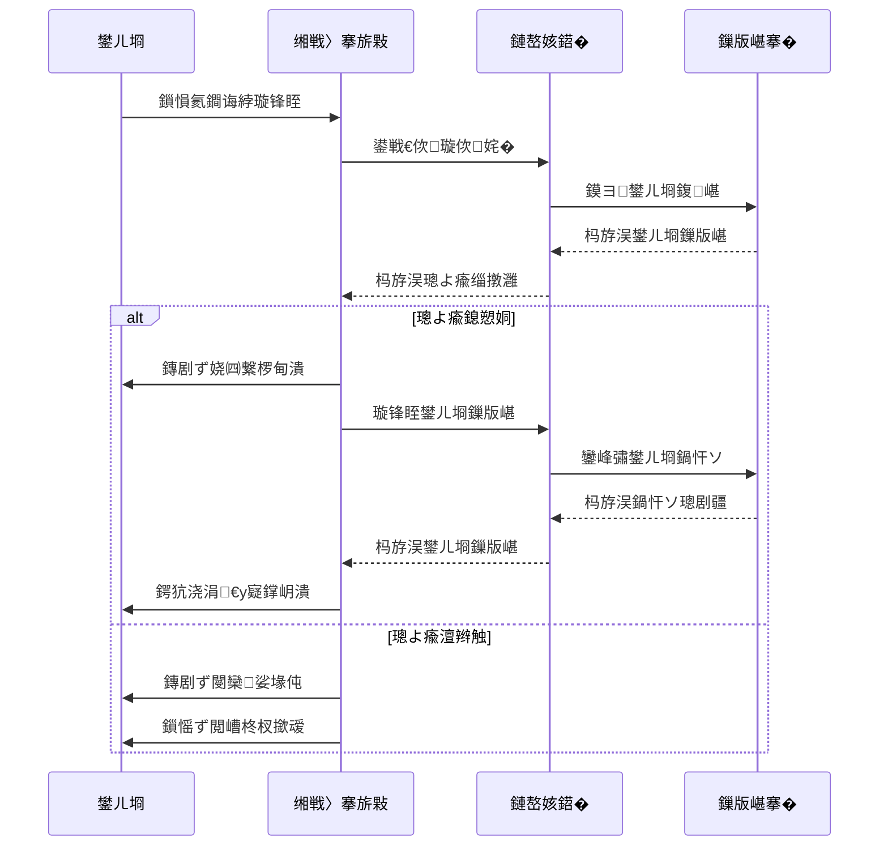
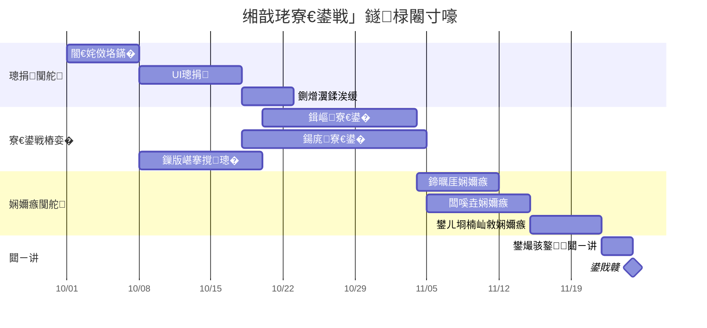
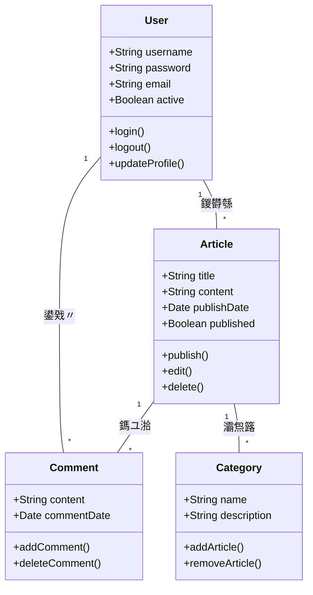
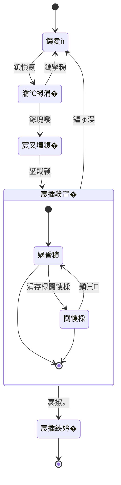
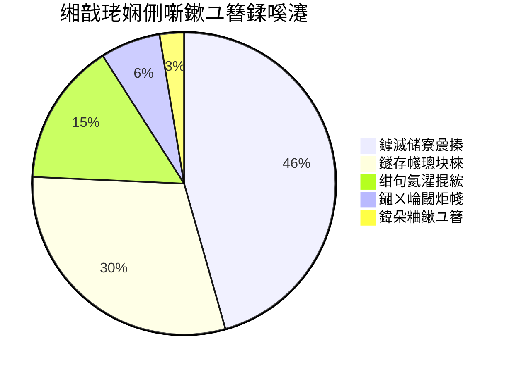

## Markdown 涓� Mermaid 鍥捐〃瀹屾暣鎸囧崡

鏈枃婕旂ず濡備綍鍦� Markdown 鏂囨。涓娇鐢� Mermaid 鍒涘缓鍚勭澶嶆潅鍥捐〃锛屽寘鎷祦绋嬪浘銆佹椂搴忓浘銆佺敇鐗瑰浘銆佺被鍥惧拰鐘舵€佸浘銆�

## 娴佺▼鍥剧ず渚�

娴佺▼鍥鹃潪甯搁€傚悎琛ㄧず娴佺▼鎴栫畻娉曟楠ゃ€�


```mermaid
graph TD
    A[寮€濮媇 --> B{鏉′欢妫€鏌
    B -->|鏄瘄 C[澶勭悊姝ラ 1]
    B -->|鍚 D[澶勭悊姝ラ 2]
    C --> E[瀛愯繃绋媇
    D --> E
    subgraph E [瀛愯繃绋嬭鎯匽
        E1[瀛愭楠� 1] --> E2[瀛愭楠� 2]
        E2 --> E3[瀛愭楠� 3]
    end
    E --> F{鍙︿竴涓喅绛杴
    F -->|閫夐」 1| G[缁撴灉 1]
    F -->|閫夐」 2| H[缁撴灉 2]
    F -->|閫夐」 3| I[缁撴灉 3]
    G --> J[缁撴潫]
    H --> J
    I --> J
```

## 鏃跺簭鍥剧ず渚�

鏃跺簭鍥炬樉绀哄璞′箣闂撮殢鏃堕棿鐨勪氦浜掋€�



## 鐢樼壒鍥剧ず渚�

鐢樼壒鍥鹃潪甯搁€傚悎鏄剧ず椤圭洰杩涘害鍜屾椂闂寸嚎銆�



## 绫诲浘绀轰緥

绫诲浘鏄剧ず绯荤粺鐨勯潤鎬佺粨鏋勶紝鍖呮嫭绫汇€佸睘鎬с€佹柟娉曞強鍏跺叧绯汇€�



## 鐘舵€佸浘绀轰緥

鐘舵€佸浘鏄剧ず瀵硅薄鍦ㄥ叾鐢熷懡鍛ㄦ湡涓粡鍘嗙殑鐘舵€佸簭鍒椼€�



## 楗煎浘绀轰緥

楗煎浘闈炲父閫傚悎鏄剧ず姣斾緥鍜岀櫨鍒嗘瘮鏁版嵁銆�



## 鎬荤粨

Mermaid 鏄湪 Markdown 鏂囨。涓垱寤哄悇绉嶇被鍨嬪浘琛ㄧ殑寮哄ぇ宸ュ叿銆傛湰鏂囨紨绀轰簡濡備綍浣跨敤娴佺▼鍥俱€佹椂搴忓浘銆佺敇鐗瑰浘銆佺被鍥俱€佺姸鎬佸浘鍜岄ゼ鍥俱€傝繖浜涘浘琛ㄥ彲浠ュ府鍔╂偍鏇存竻鏅板湴琛ㄨ揪澶嶆潅鐨勬蹇点€佹祦绋嬪拰鏁版嵁缁撴瀯銆�

瑕佷娇鐢� Mermaid锛屽彧闇€鍦ㄤ唬鐮佸潡涓寚瀹� mermaid 璇█锛屽苟浣跨敤绠€娲佺殑鏂囨湰璇硶鎻忚堪鍥捐〃銆侻ermaid 浼氳嚜鍔ㄥ皢杩欎簺鎻忚堪杞崲涓虹編瑙傜殑鍙鍖栧浘琛ㄣ€�

灏濊瘯鍦ㄦ偍鐨勪笅涓€绡囨妧鏈崥瀹㈡枃绔犳垨椤圭洰鏂囨。涓娇鐢� Mermaid 鍥捐〃 - 瀹冧滑灏嗕娇鎮ㄧ殑鍐呭鏇村姞涓撲笟涓旀洿鏄撶悊瑙ｏ紒